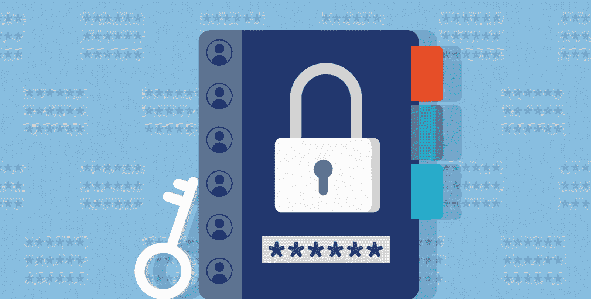
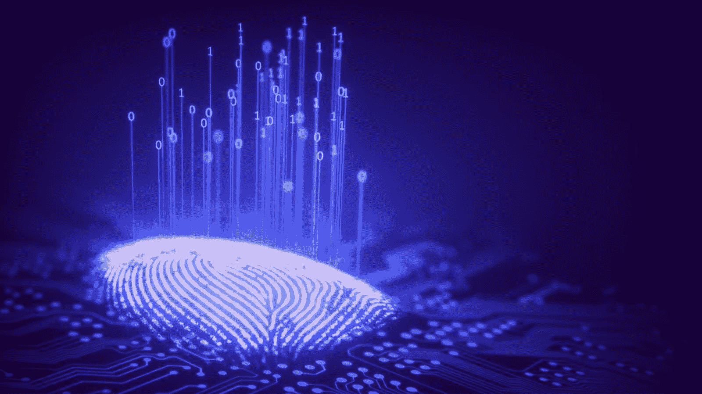
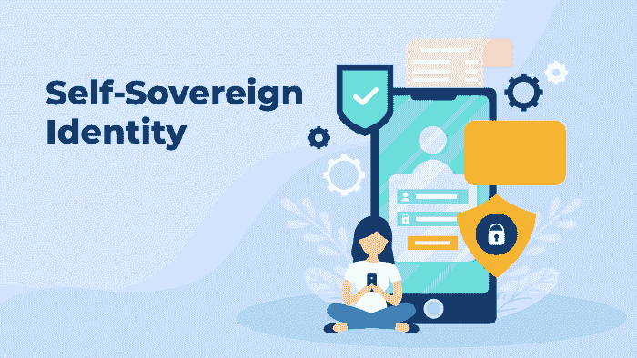
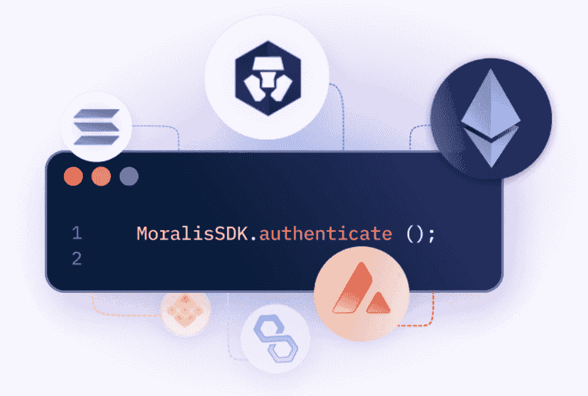
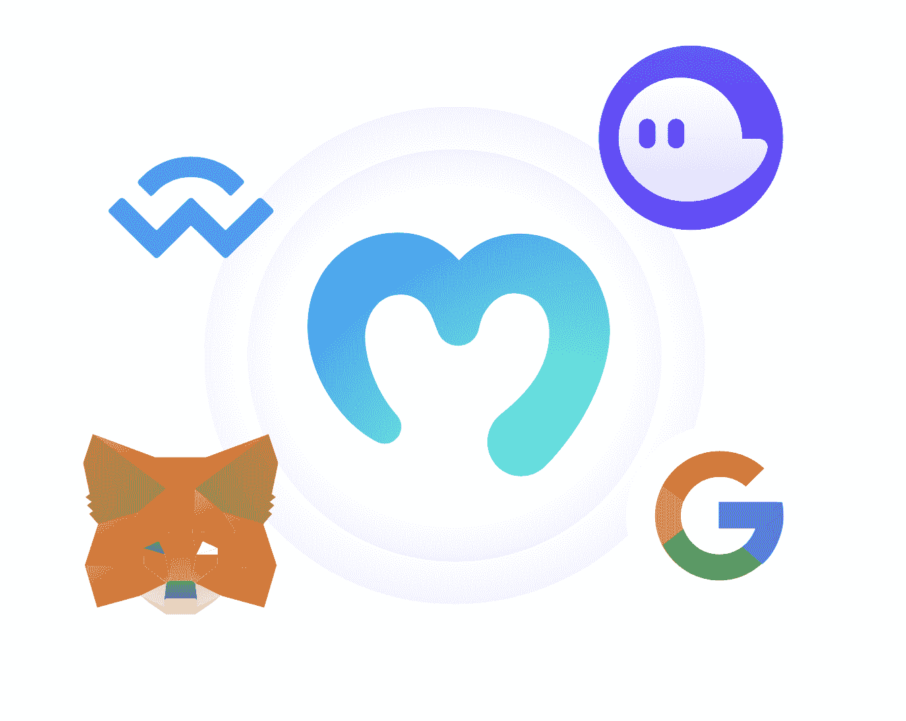

# Web3 身份——认证、身份和 Web3 的完整指南

> 原文：<https://moralis.io/web3-identity-the-full-guide-to-authentication-identity-and-web3/>

在过去的几年里，Web3 行业经历了巨大的增长。分散金融(DeFi)、不可替代代币(NFT)、分散自治组织(Dao)等。仅举几个例子，受到媒体的广泛关注和资助。此外，我们可能会看到这些行业继续增长。然而，在这些概念的阴影下，我们发现了有趣且同样令人兴奋的 Web3 身份的概念。一个 Web3 对用户的认同是 [**Web3 发展**](https://moralis.io/how-to-build-decentralized-apps-dapps-quickly-and-easily/) **以及整个空间实现去中心化的全部潜力的根本。因此，这篇文章将探索所有你需要知道的关于 Web3 身份！**

为了理解什么是 Web3 身份，我们将从更仔细地研究 Web2 上下文中的身份验证和身份开始。在此过程中，我们将探索传统模型的一些缺点。接下来，我们将探讨什么是 Web3 身份，以及为什么它们对 Web3 生态系统至关重要。

一旦我们掌握了 Web3 身份的概念，我们将进一步了解如何通过[道德](https://moralis.io/)来[认证 Web3 用户](https://moralis.io/how-to-authenticate-web3-users/)！由于 Moralis 的身份验证 API，这一点只需要一行代码就可以实现，使这个过程更加无缝。最后，我们将通过探索 Web3 身份的三个潜在用例来结束一切。

Web3 身份验证 API 是允许 Moralis 在 Web2 和 Web3 开发之间架起桥梁的工具之一。此外，Moralis 使得 [Web3 syncs](https://moralis.io/syncs/) 和 [Web3 webhooks](https://moralis.io/web3-webhooks-the-ultimate-guide-to-blockchain-webhooks/) 的实现更加无缝。此外，Moralis 提供了大量的 API。在这些接口中，你会发现[的 NFT API](https://moralis.io/nft-api/) 和[的 EVM API](https://docs.moralis.io/reference/evm-api-overview) 。

因此，如果你想[成为区块链开发者](https://moralis.io/how-to-become-a-blockchain-developer/)，一定要注册 Moralis！

## Web3 身份-用户名和密码范例

互联网的早期阶段没有人的本地身份层。因此，数字身份的责任由互联网的各种网站和应用承担。这种方法适合当前的技术和当时的用户数量。然而，现在有了数十亿的网络用户，这个系统的缺点变得越来越明显。

一段时间以来，基于用户名和密码的模型一直是主导范式，尽管一再被证明是错误和不安全的模型。此外，人们不得不为不同的网站修改几个密码，导致负面的用户体验。这是显而易见的，因为有数百万美元的业务，其唯一目的是帮助个人管理他们分散的账户。

然而，主要问题不一定是糟糕的用户体验，而是个人不拥有自己的身份和数据这一事实。相反，用户基本上是从大型企业集团和企业等中央实体租用他们的身份。因此，它们容易遭受与集中化相关的风险，包括黑客攻击、审查、操纵，甚至数据丢失。

这些缺陷凸显了变革的必要性，而 Web3 和底层技术的出现可以促进变革。然而，这种在线身份处理方式的潜在转变对用户产生了积极影响，并为企业提供了创新和改善用户体验的机会。由于这很可能成为事实，我们将在下一节中更深入地探究 Web3 的复杂性，并尝试回答这个问题，“什么是 Web3 身份？”。

## Web3 和身份

数据的去中心化、开放性、所有权、安全性和控制等。，是 Web3 的一些定义特征。然而，为了完全实现去中心化和 Web3 的其他普遍特征，一个中心思想是个人需要他们自己的 Web3 身份。

如果没有 Web3 身份，人们很难验证他们的证书，这在当前的 Web3 生态系统中是有问题的。因此，Web3 身份在下一阶段的互联网中扮演着重要的角色。不幸的是，与 DeFi、DAOs、NFTs 等更突出的概念相比，所有用户的 Web3 身份的概念被忽略了。然而，一个灵活的、共享的、有弹性的身份层对于分布式网络的生态系统来说是必不可少的。那么，到底什么是 Web3 身份？

Web3 身份为用户提供了直接管理其信息的完全控制权。此外，Web3 身份通常是互联网上用于查找与特定个人相关联的信息和数据的地址。该信息包含支持数据加密、通信、登录机制等用例的信息。这些数据受到加密证据(如数字签名)的保护。

总而言之，Web3 身份基本上是一个安全可靠的个人数字身份，为他们提供了对个人数据和信息的更多控制。这与 Web2 甚至 Web1 中讨论的传统身份并不完全不同。然而，主要的区别在于所有权和互操作性。

这表明 Web3 身份以用户为中心的所有权模型为中心，可移植性是优先考虑的。因此，身份层支持继承信息的可转移性。与常见的 Web2 系统相比，该系统实现了一种主动适配的便携性解决方案。

此外，经常与 Web3 身份相关联的一个常见概念是 SSIs 或自我主权身份。也就是说，什么是 SSI？

### 自我主权身份

SSIs，或自我主权身份，将信息控制完全集中在用户周围。这最终符合 Web3 的中心思想，因为 SSI 消除了在中央服务器和数据库中存储个人信息的需要。相反，个人可以控制他们共享的信息，确保更高程度的隐私。这提供了一种以用户为中心的方法，在这种方法中，个人可以安全地交换真实的、经过数字验证的信息。

一个个人拥有自己的 Web3 身份的生态系统可以证明对企业非常有益。首先，它可以显著改善 UX(用户体验)，因为用户可以在几个不同的平台上使用相同的凭据。因此，它不再需要不同网站的多个登录凭据。

更重要的是，这将消除入职期间的摩擦。因此，只需点击一个按钮，用户就可以获得服务，而不需要注册等。这表明企业的服务将变得更容易被所有用户使用。这不仅可能会增加业务，而且还会带来更加无缝的用户体验。

对什么是 Web3 身份和 SSI 以及它们为什么对 Web3 生态系统如此重要有了更好的了解，我们可以更仔细地看看如何为这些虚拟身份实现身份验证机制。这样做的最佳方法是使用 Moralis 的 Auth API！因此，我们将在接下来的章节中深入探讨 Moralis 认证 API。

## Moralis 的认证 API–简化 Web3 认证

如果您希望创建一个全新的 Web3 应用程序，通过 Web3 身份验证连接现有的 Web2 用户数据库，或者利用 Auth0Moralis 的认证 API 将使所有这些过程更容易实现。这表明 Moralis 的 [Web3 身份验证 API](https://moralis.io/authentication/) 使您能够在多种情况下快速轻松地实现用户 Web3 身份的验证机制！

如果没有 Moralis 的身份验证 API，您将需要将用户重定向到第三方身份验证接口，完全掌握 Web3 身份验证流程，学习如何验证和签署钱包消息，建立钱包标准等。这些都是繁琐的任务，你可以通过使用道德来避免。相反，Moralis 为所有 Web3 auth 方法提供了一个统一的 API 以及一个全面的 SDK，它允许您将这些功能无缝地集成到所有项目中。更重要的是，该 API 兼容 Auth0 等其他 auth 聚合器。

此外，如果你熟悉 Web3 领域，你也会知道这个行业发展很快。因此，你需要担心新的 [Web3 钱包](https://moralis.io/what-is-a-web3-wallet-web3-wallets-explained/)和连锁店不断出现。然而，这一切都可以通过 Moralis 的 Web3 认证 API 来避免，因为它提供了一个面向未来的认证流程。

API 允许您将 Web2 开发的可访问性和易用性与 Web3 技术的功能结合起来。因此，这是一种让你轻松跨越 Web2 和 Web3 之间鸿沟的方式。因此，您可以将资源集中于最大化用户价值，因为您可以减少对实现功能的强调。

事实上，使用 Moralis 的身份验证 API，只需一行代码就可以对用户进行身份验证。这表明您不必在不必要的复杂集成上浪费时间。因此，您可以消除入职摩擦，让您的注册流程面向未来！

## Web3 身份使用案例

既然我们已经探讨了 Moralis 的身份验证 API——这是验证用户 Web3 身份的最简单方法——我们可以继续深入了解这些身份的一些潜在用例。Web3 身份的用例非常多，任何与去中心化相关的事物都会张开双臂欢迎 Web3 身份。

NFTs、元宇宙、游戏和点对点交易就是几个例子。因此，我们认为 Web3 身份的开放标准和互操作性将在持续促进多链生态系统方面发挥重要作用。

因此，为了充分理解 Web3 身份及其在 Web3 生态系统中的角色，我们将探索一些潜在的用例。我们将从 NFTs 开始！

*   **Web3 身份:NFTs**–在 NFT 地区，Web3 身份有助于证明谁在 NFT 的整个生命周期中创建、拥有和当前拥有该产品。此外，Web3 身份有助于创建 [NFT 门户网站](https://docs.moralis.io/docs/nextjs-nft-gated-website)。在这些网站中，用户必须验证并拥有至少一个来自特定 NFT 集合的令牌，才能访问锁定的内容。
*   **Web3 身份:游戏**–游戏是一个令人兴奋的应用领域。在这个领域，有可能混合 NFTs、Web3 身份和游戏来形成一些独特的东西。这种组合可以为游戏玩家带来全新的体验。虽然 NFT 是捕捉稀缺性和独特性的理想选择，但 Web3 身份非常适合存储特征，尤其是当它们对玩家来说是独一无二的时候。
*   **Web3 身份:元宇宙**–在游戏行业或其他地方，可验证和可互操作的 Web3 身份对于元宇宙和完整的用户体验至关重要。这将适用于几个层面，从创建用户配置文件到元宇宙内的交易，创建、购买和移动化身/资产的能力等。

## Web3 身份-摘要

从传统观点来看，在线身份识别主要是网页和应用程序背后的组织的责任。然而，经过更仔细的检查，我们强调了当前基于用户名和密码的集中式模型的缺陷。在新的 Web3 范式下，这种过时的模式没有多大意义。因此，这个空间适应并创造了所谓的 Web3 身份。

去中心化、开放性、安全性等。，是 Web3 的普遍特征。要实现这些，用户必须控制自己的 Web3 身份。这为用户提供了更多的隐私和安全性。然而，一个面向所有用户的 Web3 身份也给企业和组织带来了积极的好处。此外，Web3 身份使入职流程更加无缝，并提供更具吸引力的客户体验，使品牌更具吸引力。

此外，除了探索 Web3 身份的复杂性之外，我们还仔细研究了 Web3 身份验证。在此过程中，我们探索了 Moralis 的 Web3 身份验证 API，使这一过程变得更加容易理解。事实上，使用这个 API，只需一小段代码就可以对用户进行身份验证！如果你想了解更多信息，请访问 Moralis 的认证文档。

然而，这只是 Moralis 平台大放异彩的领域之一。想了解更多关于 Web3 开发的信息，可以看看 Moralis 的博客。例如，学习如何[通过地址 API](https://moralis.io/how-to-fetch-an-nft-by-address-api-exploring-the-nft-api/) 获取 NFT，[从多边形区块链](https://moralis.io/how-to-pull-data-from-polygon-blockchain/)提取数据，或者发现你需要知道的关于[区块链同步](https://moralis.io/blockchain-syncs-exploring-on-chain-syncing/)的一切！这样，你可以很快将你的区块链开发技能提升到一个新的水平！

如果你想成为一名更杰出的 Web3 开发者，请立即注册 Moralis。创建一个帐户是免费的，只需要几秒钟；你没什么可失去的！