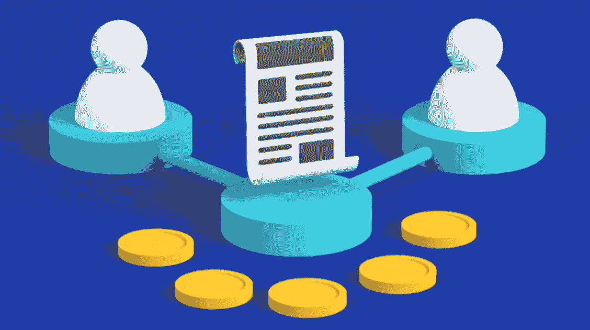
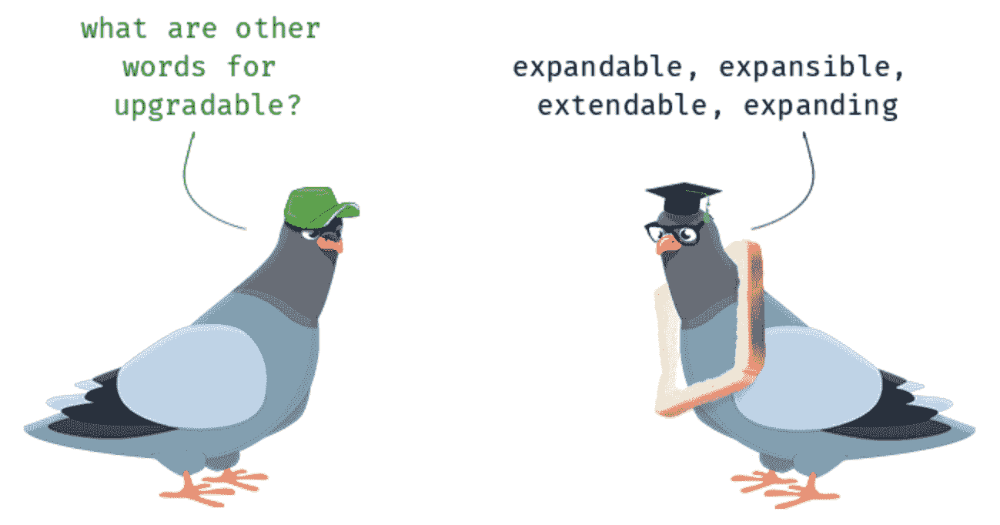
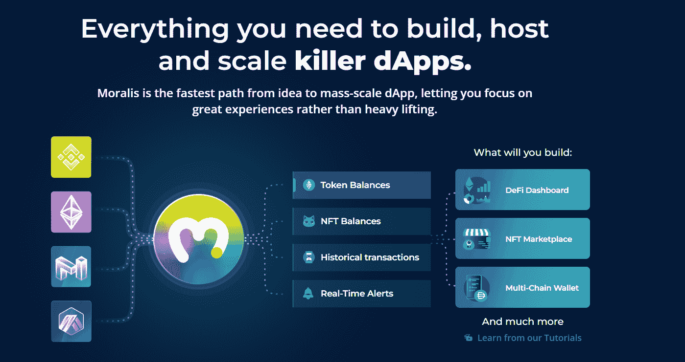
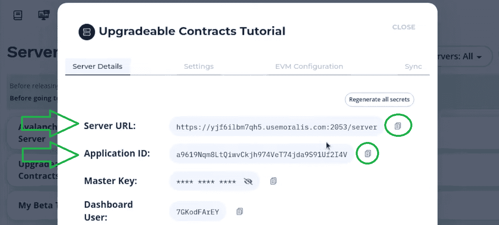
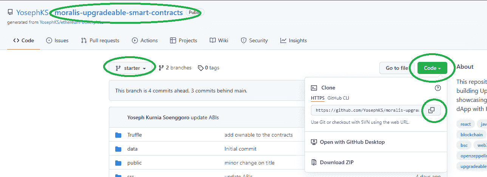
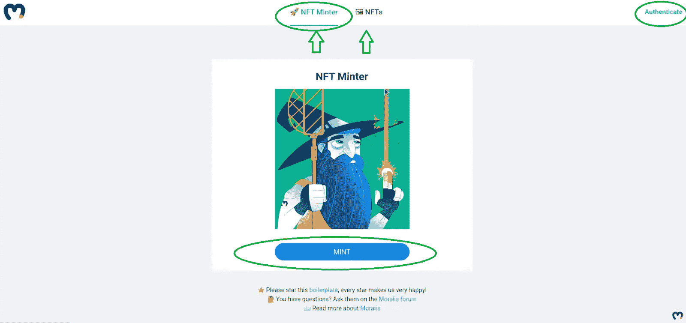
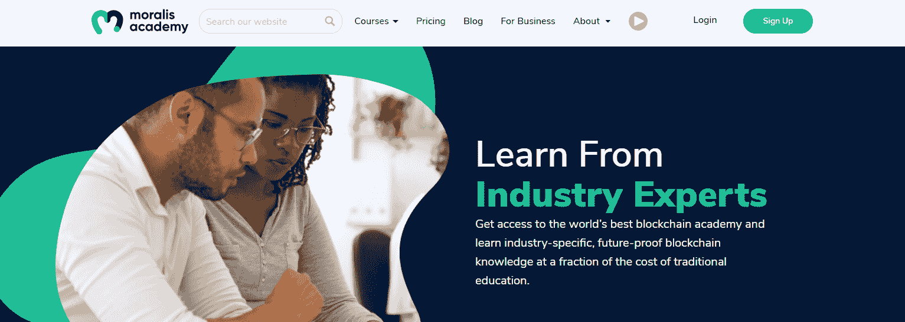

# 什么是可升级智能合约？完整指南

> 原文：<https://moralis.io/what-are-upgradable-smart-contracts-full-guide/>

熟练的智能合同开发人员努力将合同提升到一个新的水平。其中包括修改或升级智能合同的方法。然而,“可升级智能合同”的概念即使对有经验的人来说也可能难以理解。因此，请记住，可升级的智能合约绝对不属于“初学者”类别。然而，即使你是初学者，这篇文章也会非常有用。那么，什么是可升级智能合约呢？请跟随本指南，我们将探索可升级智能合约的基础，并了解它们是如何工作的。

接下来，您将首先学习什么是可升级智能合约，以及它们是如何工作的。然后，我们将看看透明代理和可升级代理。此外，我们将解释如何使合同可升级，并解决这些类型的合同的主要限制。尽管如此，你将有机会承担一个示例项目。反过来，你将有机会跟随我们的领导，创建你自己的 [NFT minting](https://moralis.io/how-to-mint-nfts-full-tutorial-to-minting-an-nft/) [dApp](https://moralis.io/decentralized-applications-explained-what-are-dapps/) (去中心化应用)。后者将包含一个智能合同，您将对其进行升级。因此，您将正确地学习如何使用可升级的智能合同。在这个过程中，你将了解终极的 [Web3](https://moralis.io/the-ultimate-guide-to-web3-what-is-web3/) 开发平台 [Moralis](https://moralis.io/) (也称为 [Firebase for crypto](https://moralis.io/firebase-for-crypto-the-best-blockchain-firebase-alternative/) )。这个优秀的工具使您能够轻松满足所有与区块链相关的后端需求。因此，请务必今天就[创建您的道德账户](https://admin.moralis.io/register)。

如前所述，可升级的智能合约可能很难理解。所以，建议先学一些基础。因此，在继续前进之前，我们建议了解“ [*的问题，Web3 是如何工作的？*](https://moralis.io/how-does-web3-work-web3-explained/)*[*什么是坚固性？*](https://moralis.io/solidity-explained-what-is-solidity/)*[*什么是智能合约？*](https://moralis.io/smart-contracts-explained-what-are-smart-contracts/) *”。***

**

## 什么是可升级智能合约？

你可能知道智能合约是所有可编程区块链的重要组成部分(比如在[以太坊](https://moralis.io/full-guide-what-is-ethereum/))。通过确保事情按照预先定义的规则运行，智能合约强制执行订单。没有智能合约，就不会有加密令牌、 [NFTs](https://moralis.io/non-fungible-tokens-explained-what-are-nfts/) 和 dApps。但是，什么是可升级智能合同？首先，您需要注意，在这种情况下，“可升级”一词并不意味着可变。 [EVM](https://moralis.io/evm-explained-what-is-ethereum-virtual-machine/) 的一个基本规则是，合同一旦签订，就不能更改。相反，可升级的智能合约使用特殊的代理模式。后者涉及部署代理契约和实现契约(逻辑契约):


## 可升级智能合同如何工作？

查看上面的示意图，您可以看到用户通过代理契约与逻辑契约进行交互。这是可能的，因为代理契约能够存储逻辑契约的地址。然后，我们通过部署新的逻辑契约来合并升级。当然，我们还需要在代理契约中更新逻辑的契约相关值，以实际实现升级。

有许多可用的代理模式，可用于创建可升级的合同。此外，虽然也有许多类型的代理模式，但大多数代理模式使用透明代理和 UUPS(通用可升级代理标准)。幸运的是，open zeppelin 也提供了这两种类型，这让开发人员的工作变得简单多了。此外，这也是一个快捷方式，我们将在一个示例项目中学习更多。



### 透明 vs UUPS 代理

如上所述，透明和 UUPS 代理模式是两种最常见的类型。虽然这两种类型遵循相同的基本原理(如上所述)，但它们的发动机罩下有着相当不同的设计。因此，我们需要对它们进行快速比较。以下是两种代理模式类型的一些主要特征:

*   **透明代理图案类型**:
    *   升级由代理合同处理。
    *   部署成本更高。
    *   这使得事情易于维护。
*   **UUPS 代理特征码类型**:
    *   升级由实施合同处理。这也意味着您需要在实施合同中实施升级功能。否则，您将无法升级您的智能合同。
    *   部署更便宜。
    *   这使得维护更具挑战性。


## 如何让智能合约升级？

至此，您知道了什么是可升级契约，它们是如何工作的，以及两种主要的代理模式类型是什么。因此，您已经准备好学习如何使合同升级。而且，如上所述，我们不需要从零开始。相反，我们可以使用 OpenZeppelin 实现。因此，我们不需要自己构建代理模式。考虑到这一点，我们必须完成以下步骤才能升级合同:

1.  首先，我们需要继承一个可初始化的契约。这是通过一行简单的代码完成的:

```js
contract ExampleContractName is initializable {}
```

默认情况下，上面一行代码用于透明代理模式。但是，在使用 UUPS 代理模式时，我们需要添加“UUPSUpgradable”。因此，这是在这些情况下使用的代码行:

```js
contract ExampleContractName is initializable, UUPSUpgradable {}
```

2.  接下来，我们需要将构造函数改为初始化函数。这意味着我们从 *"constructor () {}"* 到 *"* ***函数 initialize()public initializer { }****"。* *还有，注意函数名不一定要“初始化”。然而，“初始化器{}”部分是必不可少的。*

3.  然后，我们需要将所有 OpenZeppelin 契约库更改为它们的可升级版本。反过来，我们确保我们的可升级智能合约使用升级的库。以下是一些例子:


4.  接下来，我们需要在初始化函数中调用可升级契约的 **"_init"** 函数。这里有一个例子:

```js
function initialize() initializer public {
__ERC1155_init(“”);
__Ownable_init();
__UUPSUpgradeable_init();
}
```

5.  最后，我们需要将 *"msg.sender"* 改为"***_ msg sender()****。这将使我们能够处理用户的钱包地址，而不是代理地址。*

### *可升级智能合约的主要限制*

*在开始我们的示例项目之前，让我们先解决可升级智能合约的主要限制。要考虑的最重要的方面是存储冲突:*

*

查看上面的图像，您可以看到在新的实现契约版本中，顶部不应该有新的变量(旧变量的中间也不应该有)。但是，如果将新变量放在底部，就可以避免存储冲突。

## 可升级智能合同的实施——一个示例项目

如上所述，你现在将有机会使用上面获得的关于可升级智能合同的知识。按照我们的指示，你会很容易地创建一个 NFT 铸造 dApp。当然，除了使用 OpenZeppelin，我们还将严重依赖 Moralis。为什么？嗯，这让事情变得更简单快捷。当我们将道德的力量与最实用的以太坊 dApp 样板结合起来时，这一点尤其正确。这个终极的 [Web3 样板](https://moralis.io/web3-boilerplate-beginners-guide-to-web3/)让我们能够在几分钟内拥有功能齐全的 dApps 和干净的 UI。当然，这两种工具都需要初始设置。因此，让我们从这里开始。因此，我们将向您展示如何创建一个 Moralis 服务器，初始化 [Moralis SDK](https://moralis.io/exploring-moralis-sdk-the-ultimate-web3-sdk/) ，并涵盖以太坊 dApp 样板的初始设置。



### 道德设置

无论您想从头构建 dApps 还是使用我们的 Web3 样板，您都需要从一个简单的 Moralis 设置开始。要完成初始 Moralis 设置，请遵循以下步骤:

1.  [**创建你的免费道德账户**](https://admin.moralis.io/register)——点击左边的链接，你将进入注册页面。在那里，输入您的电子邮件，创建您的密码，并通过单击确认链接(检查您的电子邮件收件箱)来确认帐户创建。*另一方面，如果你已经有一个活跃的 Moralis 账户，只需* [*登录*](https://admin.moralis.io/login) *。*

2.  [**创建一个 Moralis 服务器**](https://docs.moralis.io/moralis-server/getting-started/create-a-moralis-server)–在您的 Moralis 管理区域中，转到“服务器”选项卡。接下来，单击“+创建新服务器”(右上角)。然后，您会看到一个下拉菜单，提供不同的服务器类型(见下面的截图)。确保选择最适合您需求的网络类型。*在处理示例项目或测试您的 dApps 时，关注“Testnet 服务器”(* [*)以太坊测试网*](https://moralis.io/ethereum-testnet-guide-connect-to-ethereum-testnets/) *)或“本地 Devchain 服务器”选项。然而，一旦你想让你的 dApp 对公共用户可用，选择“Mainnet 服务器”。*


接下来，您将看到一个弹出窗口，要求您输入服务器名称(可以是您想要的任何名称)，然后选择您所在的地区、网络类型和链。要最终启动服务器，请单击“添加实例”按钮:


3.  **访问服务器详细信息**–创建服务器后，您可以通过点击“查看详细信息”按钮来访问其详细信息(服务器 URL 和应用程序 ID):


现在，您应该可以在新窗口中看到服务器的详细信息。此外，您可以简单地复制您的服务器的 URL 和您的应用程序 ID。为了更加方便，每个细节的右侧都有复制图标:



#### 初始化道德

*注* *:暂时跳过这一步。你将被告知何时返回并完成它。*

4.  **初始化 Moralis***–*准备好编码文件后，通过填充相关文件来初始化 Moralis 及其 SDK。*当使用样板文件时，你用“.env”文件。*因此，只需将您服务器的详细信息粘贴到指定位置:


### 以太坊样板设置

为了这个示例项目，我们将使用最终的 Web3 样板。这将显著简化和加快我们的工作。事实上，当不需要创建独特的 UI 时，我们建议您总是使用这个样板文件。而且这个样板在 GitHub 上是公开的(只要用谷歌，在搜索栏输入“以太坊样板”就可以了)。然而，我们决定通过向您提供对我们完成的代码("[moralis-upgradable-smart-contracts](https://github.com/YosephKS/moralis-upgradeable-smart-contracts)")的访问权，让事情变得更加简单。不过，为了让你做一些实际的编码，我们建议你从我们的[启动代码](https://github.com/YosephKS/moralis-upgradeable-smart-contracts/tree/starter)开始，它本质上只是一个稍微调整的以太坊样板。通过克隆起始代码或最终版本，您将很容易理解本文中的代码演练。

#### 以太坊样板设置–分步说明

以下是使用我们修改过的样板文件需要完成的步骤:

1.  首先点击上面的“starter code”链接，在 GitHub 访问代码。

2.  然后，单击“代码”按钮，然后通过单击“复制”图标复制地址:



3.  接下来，使用代码编辑器的终端克隆上面复制的代码地址。*我们通常使用 Visual Studio 代码(VSC)；然而，你可以随心所欲地选择。*这是你需要使用的命令行:

    ***git clone[****将复制的 HTTPS 地址粘贴到这里****】***

**   现在，是时候安装所有的依赖项了。因此，我们使用 VSC 的终端。我们需要输入以下命令行:*

**   ***cd 道德-可升级-智能-合同****   ***纱线安装****

*注意:除了使用“yarn ”,你也可以使用“npm”包管理器。*

**   然后，将“. env.example”文件重命名为”。env”。这也意味着你已经准备好完成上一部分的最后一步(第四步)。因此，填充您的”。env "文件，其中包含服务器的详细信息。*

**   完成以上步骤后，您就可以运行您的应用程序了。这样，只需粘贴或键入“ ***纱开始*** ”进入 VSC 的终端:*

*

一旦你完成了上面的设置，你还需要做一个简单的[松露](https://moralis.io/truffle-explained-what-is-the-truffle-suite/)设置。为此，请务必在 20:25 开始观看下面的视频。

### 使用可升级的智能合约–web 3 应用预览和代码演练

完成以上设置后，你就可以卷起袖子创建你自己版本的 NFT 造币 dApp 了。为此，请按照下面的视频教程中提供的详细说明进行操作(从 23:32 开始)。在那里，Moralis 专家将主要关注智能合约，并演示如何确保它们实际上是可升级的。此外，您还可以自己升级合同。此外，他将向您展示如何使用 OpenZeppelin 和 Etherscan。

此外，如果您知道实际创建的是什么，那么创建 dApp 会简单得多，下面是我们的 dApp 预览示例:



如您所见，我们的 dApp 看起来与样板 dApp 非常相似。这也是为什么“认证”按钮和“NFTs”部分不需要额外的工作。因此，下面的视频教程主要集中在“NFT 明特”部分。

这是我们在整篇文章中引用的视频教程:

https://www.youtube.com/watch?v=af1i0z0jhkg

## 什么是可升级智能合约？完整指南-摘要

至此，您已经了解了什么是可升级智能合约以及如何创建它们。您还应该知道两种主要的代理模式类型及其主要区别。此外，可升级合同的关键限制也应该不再陌生。此外，我们希望你已经采取了上述项目的例子。因此，您应该已经学会了如何正确设置 Moralis，以及如何使用 Ethereum 样板加速 dApp 开发。有了这些强大的工具，您未来的区块链开发将会简单得多。

如果你想继续你的免费加密教育，那么 [Moralis YouTube 频道](https://www.youtube.com/c/MoralisWeb3)和 [Moralis 博客](https://moralis.io/blog/)是值得去的地方。这两个出口提供了各种区块链方面的简单解释和无数的例子项目。例如，我们的一些最新主题向您展示了如何在 2022 年[获得一个 OpenSea API 密钥](https://moralis.io/get-an-opensea-api-key-in-2022-full-guide/)，终极 [Web3 技术堆栈](https://moralis.io/exploring-the-web3-tech-stack-full-guide/)，如何[创建一个伟大的 dApp UI](https://moralis.io/web3-ui-how-to-create-a-great-dapp-ui/) ，如何使用 [Web3 认证](https://moralis.io/web3-authentication-the-full-guide/)工具快速构建一个 [Web3 登录](https://moralis.io/how-to-build-a-web3-login-in-5-steps/)，关于 [gasless 事务的细节](https://moralis.io/gasless-transactions-exploring-gasless-transactions-on-ethereum/)， [NFT API 替代方案](https://moralis.io/nft-api-alternatives-comparing-alchemys-nft-api-with-moralis-nft-api/)， [Web3.js vs](https://moralis.io/web3-js-vs-ethers-js-guide-to-eth-javascript-libraries/)

另一方面，你可能想尽快成为全职加密员。如果是这样的话，你肯定需要考虑报读[道德学院](https://academy.moralis.io/)。通过这样做，你将获得专业课程，进步和支持社区，以及专家指导。如果你想在 2022 年[成为区块链开发商](https://moralis.io/how-to-become-a-blockchain-developer/)，所有这些都是必不可少的资产。

****