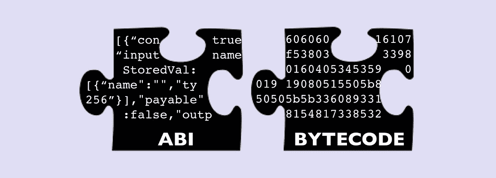
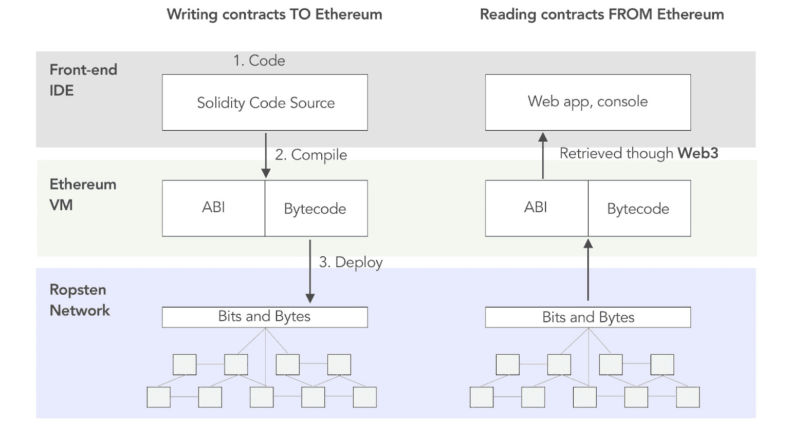
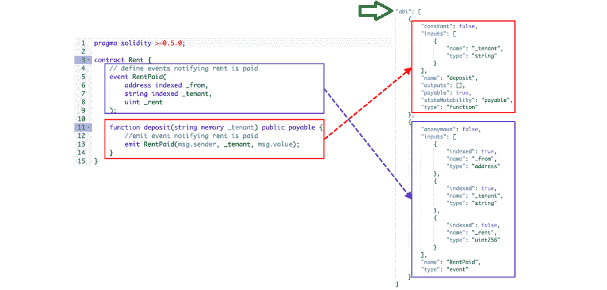
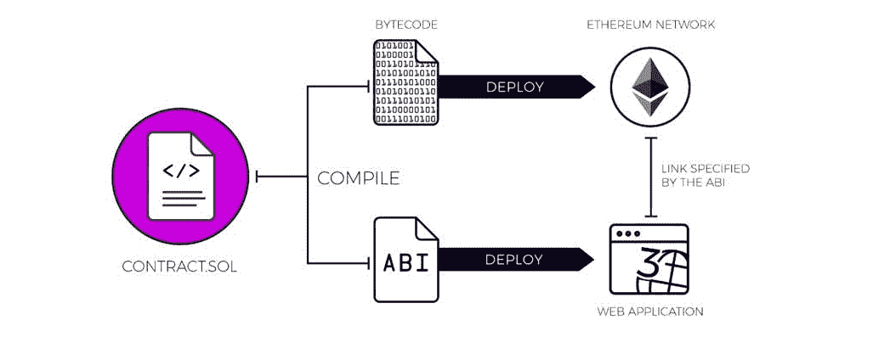
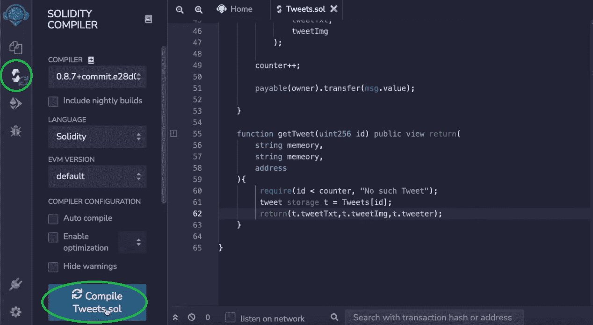
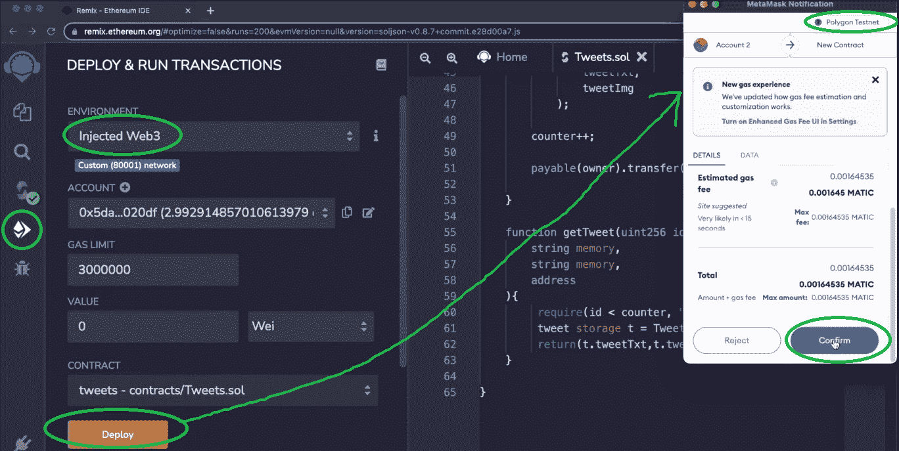
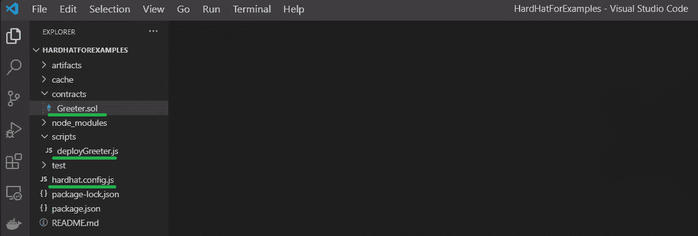
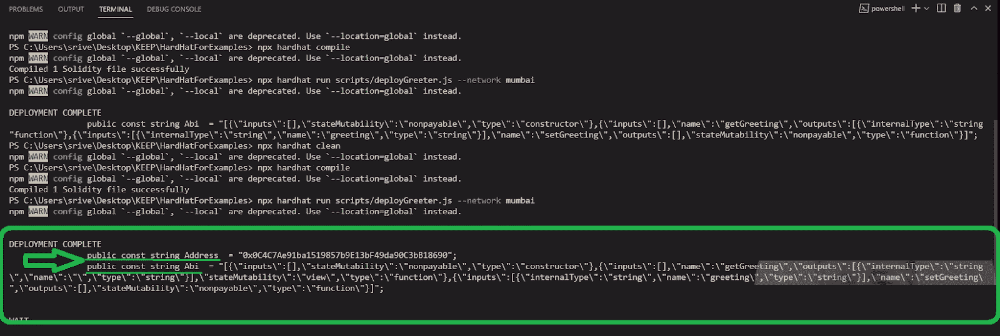
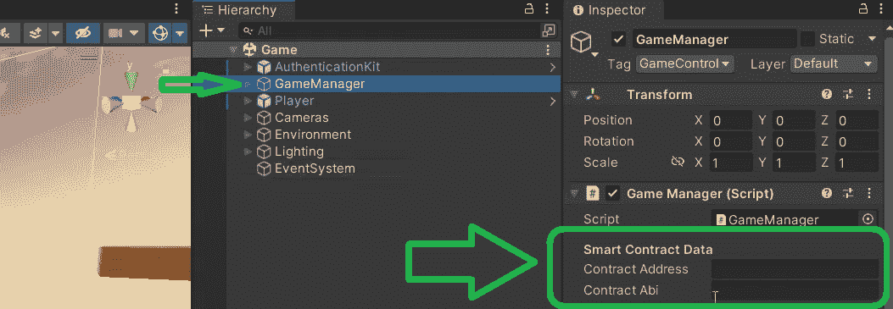

# 什么是智能合同 ABI？完整指南

> 原文：<https://moralis.io/what-is-a-smart-contract-abi-full-guide/>

**要不要创建你的第一个** [**去中心化应用**](https://moralis.io/decentralized-applications-explained-what-are-dapps/) **(dapp)？或者一个 Web3 游戏？如果是这样的话，知道什么是合同 ABI 以及如何使用它是相当重要的。当然也有一些 dapps 可能不需要这方面。然而，一旦你开始合并可替换的或者** [**不可替换的令牌**](https://moralis.io/non-fungible-tokens-explained-what-are-nfts/) **(NFTs)，你就无法绕过它。此外，也许你已经接手了我们的一些示例项目，并复制粘贴了一个特定的合同 ABI，而没有真正知道它到底做了什么。好吧，今天我们将澄清一些事情，并确保你们都知道这个智能合约的属性是什么。**

首先，我们将首先解释什么是智能合同 ABI。然后，我们将告诉你为什么 ABI 是重要的，以及他们如何适应区块链编程。此外，我们还将了解如何使用 ABIs。因此，我们将向您展示如何获得任何智能合同 ABI。幸运的是，您有几个选择来做到这一点。因此，你可以选择最适合你和你的项目的。尽管如此，我们还是会给你一个机会把在这里学到的知识付诸实践。我们将与您分享一些示例项目，其中您需要使用智能合同 ABI 来实现示例 dapps 的全部功能。如果你对此感兴趣，请务必[创建你的免费道德账户](https://admin.moralis.io/register)并跟随我们。

# 什么是智能合同 ABI？

首先，让我们看看 ABI 代表什么——特别是应用程序二进制接口。基本上，智能合约 ABI 充当代理，使 Web3 合约能够与外部应用程序和其他智能合约进行通信和交互。我们都知道，从外部来源接收数据对于迎合用户和完成应用程序的目标来说往往是至关重要的。

## 合同 ABI 背景

ABI 不是独立存在的。因此，重要的是你要对将它们带入生活的技术有一个基本的了解。没有智能合约，就没有合约 ABIs。此外，智能合约本质上是运行在区块链上的软件。在以太坊和其他 EVM 兼容链的情况下，Web3 合同是核心应用。它们被编程以确保事情按照一定的规则运行。因此，当满足特定条件时，它们会执行预定义的操作。此外，重要的是要注意，这些条件可以是链上或链外事件。

当谈到 [EVM](https://moralis.io/evm-explained-what-is-ethereum-virtual-machine/) (以太坊虚拟机)，开发人员使用 Solidity 编程语言创建智能合同。而且，虽然 Solidity 是一种高级语言，但是合同作为可执行字节码存储在 EVM 上。后者是二进制格式，不可读。因此，字节码需要一个适当的解释才能理解它——进入契约 ABI。顾名思义，应用程序二进制接口服务于那些编写智能合同的人。ABI 使它们能够在 EVM 理解的字节码和用高级语言(例如:JavaScript)编写的 web 应用程序之间进行通信。

### API 对 ABI

因为您可能更熟悉 Web2，所以对 API 和 ABI 进行比较是有意义的。您可能知道，在 Web2 中，应用程序和服务器之间的数据通信是通过 API 进行的。这是可能的，因为服务器是信息的集中来源。因此，它们很容易根据请求向应用程序提供数据。然而，区块链的核心属性是权力下放。因此，没有集中的数据来源。相反，有充当服务器的节点。此外，还有智能合同，这是链上程序。您也可以将它们视为链上的“托管”函数。因此，契约 ABI 使离线应用程序和其他智能契约能够与该契约进行通信。你可能会熟悉 Moralis 最流行的 API，比如 [NFT API](https://moralis.io/nft-api/) 和我们的[认证 API](https://moralis.io/authentication/) 。

在某种程度上，ABI 是 APIs 的表亲。总而言之，契约 ABI 充当了函数选择器的角色。它定义了 app 或 dapp 可以调用的具体方法。然后，有问题的智能合约通过执行特定功能来响应该调用。此外，一个生成的 JSON RPC 文件列出了这些特定的方法和连接到它们的数据类型。下图清楚地显示了如何将智能合同的详细信息转换为合同 ABI:

### 契约 ABI——一个字节码“翻译器”

如上所述，智能契约只以字节码进行通信。因此，与 API 不同，我们不能以 JSON 格式直接发送请求。后者必须被翻译(编码)成 EVM 人能理解的语言。这是通过 ABI 编码完成的。这些“翻译”包括所有的细节，包括函数签名和变量声明。因此，EVM 确切地知道在给定的 Web3 契约中执行哪个函数。

不用说，响应也在字节码中。因此，在 web 应用程序处理响应之前，需要进行解释。此外，由于响应是用字节码表示的，所以在调用契约的函数时，我们总是可以期待某种特定的结构。这是一个很大的优势。

既然你知道什么是 ABI 合同，让我们解释一下如何使用它。

## 使用合同 ABI

使用智能合约 ABI 时，您需要了解三个方面:

*   生成智能合同 ABI
*   执行智能合同 ABIs
*   编码智能合同 ABIs

当涉及到生成契约 ABI 时，根据您使用的工具，您有几个著名的选项。如果您使用 Hardhat 或 Remix 来部署智能合约，这些工具将自动生成该合约的 ABI。但是，您可以手动生成合同 ABI。在这种情况下，你需要安装可靠性编译器 NPM 包。有了这个包，您就可以使用您的终端并输入“solcjscontractname . sol–ABI”命令。如果事情进展顺利，后者将生成一个 ABI 文件。

到目前为止，您已经知道契约 ABI 充当字节码和高级语言之间的解释器。此外，您还知道，通过执行 ABI，您可以执行相应智能合约的功能。但是，为了执行智能合约 ABI，您还需要该智能合约的地址。幸运的是，上面提到的工具也为您提供了这些信息。此外，一旦你有一个智能合同的地址，你可以很容易地使用区块链探索者找到其他细节。这包括一份 ABI 合同。

### 编码智能合同 ABIs

编码是 Remix 等流行编译器可以帮助你的另一个方面。此外，这些类型的编码遵循一定的模式。如果您对深入研究编码感兴趣，我们建议您探索 ABI 规范。后者可以在 Solidity 文档中找到。例如，前四个字节是函数签名。这指示智能合约中正在执行的功能的类型。函数标识符的一个常见示例是“a 9059 cbb”(er C20 传输)。要了解更多细节，您可以探索函数签名的数据库目录。

在最初的四个字节之后，编码的字节码存储函数的参数。此外，智能合同对类似的结构作出反应。然而，在这种情况下，没有函数签名。

### 获取智能合同 ABIs

我们上面提到过，当使用 Remix 或 Hardhat 时，您可以在部署智能合约时获得 ABI。另一方面，您也可以使用智能合同的地址或项目名称，并使用区块链资源管理器基于这些详细信息进行搜索。在本节中，我们将向您展示在哪里可以找到每种方法的合同 ABI。

#### 使用混音

使用 Remix 时，您必须先将您的智能合约键入或粘贴到新的”。sol”文件。接下来，您需要编辑您的合同:

一旦您成功编译了您的智能合约，您就可以部署。此外，在部署时，您有几种选择；下图显示了最常见的设置:

成功部署合同后，您可以复制其 ABI。为此，你需要返回到“Solidity 编译器”标签并向下滚动。在那里，您会看到复制图标和“ABI”:

因此，只需点击上面标记的区域，你就会有你的智能合同的 ABI 在你的剪贴板。

#### 使用安全帽

与 Remix 不同，Remix 可以在网上找到，你需要在本地安装 Hardhat。因此，您需要先完成一些初始设置。然而，一旦你创建了一个 Hardhat 项目，你就会得到你需要的模板文件。接下来，您需要调整这些文件以匹配您的项目和智能合同。本质上，您需要一个智能协定文件、一个配置文件和一个部署文件:

准备好这些文件后，您就可以使用终端部署契约了。部署完成后，您的终端将为您提供合同地址和 ABI:

*注* *:从上面的截图可以看到，终端为您提供了一个“字符串”格式的合同 ABI。因此，在需要“对象”格式的情况下，您需要每年或使用在线工具进行转换。*

#### 使用区块链浏览器

在使用现有智能合约的情况下，使用区块链资源管理器获取合约 ABI 尤其实用。幸运的是，每一个流行的可编程区块链都有其主网和测试网的浏览器(例如:Etherscan、Polygonscan、Bscscan、Snowtrace 等)。).

所以，让我们来看一个流行的 NFT 项目 CryptoPunks。由于项目在以太坊上，我们需要使用以太扫描。我们可以使用搜索栏并输入项目名称。然而，如果我们有项目的合同地址，我们可以将它粘贴到搜索栏中。接下来，我们需要点击 CryptoPunks 的合约地址:

在下一页，我们必须向下滚动一点，直到我们看到一个以“Transactions”开始的水平选项栏。“合同”选项卡是我们需要关注的一个选项卡:

一旦进入“合同”选项卡，我们需要确保我们处于“代码”部分:

如果是这样，我们可以向下滚动，直到看到“合同 ABI”。在右侧，我们可以使用复制图标来复制合同 ABI:

## 学习使用合同 ABIs 示例项目

正如简介中所承诺的，我们鼓励你采取行动，学习如何使用合同 ABIs。因此，您将使用上面介绍的获取这些细节的方法。此外，这也是学习如何使用 Moralis 创建杀手级 dapps 和 Web3 游戏的最佳方式。因此，这里有一些我们建议着手的项目范例:

*   [将 NFT 转换成游戏中的物品](https://moralis.io/how-to-convert-an-nft-to-an-in-game-item/)——这是一个 Unity Web3 项目，在这里你将学习如何使用 Moralis 的 Unity Web3 SDK。此外，您还将学习如何使用 NFTs 作为游戏中的电源。在此过程中，您还将获得一份智能合同 ABI，并将其粘贴到 Unity 中:

*   [同步智能合约 Web3 事件](https://moralis.io/web3-syncing-how-to-sync-smart-contract-web3-events/)–在本项目中，您将学习如何使用 Moralis 来同步和索引智能合约事件。在此过程中，您还将学习如何使用 Etherscan 来获取 ABI 和其他智能合同详细信息:

尽管如此，下面你可以找到一个关于调用 Unity 智能合约的视频教程。这是学习如何使用 Hardhat 获得合同 ABIs 的最佳地方。此外，在这个视频中，您还可以看到“字符串”格式和“对象”格式的 ABI 示例。

https://www.youtube.com/watch?v=0S8JTkcjpsA

## 什么是智能合同 ABI？完整指南-摘要

在今天的文章中，我们已经谈了相当多的内容。首先，您了解了智能合约 ABI 的基本知识。这也是我们讨论智能合同要点的地方。然后，知道 ABI 本质上是支持字节码和高级语言之间通信的解释器，您就有机会了解如何使用 ABI。此外，我们还向您展示了在哪里以及如何使用不同的 Web3 开发工具来获取智能合同细节。最后但同样重要的是，你有机会承担一些实例项目，将理论付诸实践。这也是你能够亲身体验道德力量的地方。

此外，如果您有兴趣探索其他区块链发展主题或承担额外的示例项目，我们鼓励您访问 Moralis 的 [Web3 博客](https://moralis.io/blog/)和 Moralis 的 [Web3 YouTube 频道](https://www.youtube.com/c/MoralisWeb3)。这两个出口可以免费帮助你成为 Web3 开发者。然而，如果你想尽快成为全职加密员，那么[道德学院](https://academy.moralis.io/)可能是你的好去处。此外，如果你想了解 NFT 的秘密，一定要向经验丰富的 [NFT 程序员](https://nftcoders.com/)学习——例如学习实用的 [NFT 用例](https://nftcoders.com/learning-all-about-nft-use-cases-in-2022/)或[如何入股 NFT](https://nftcoders.com/the-2022-guide-to-nft-staking-how-to-stake-nfts/)！